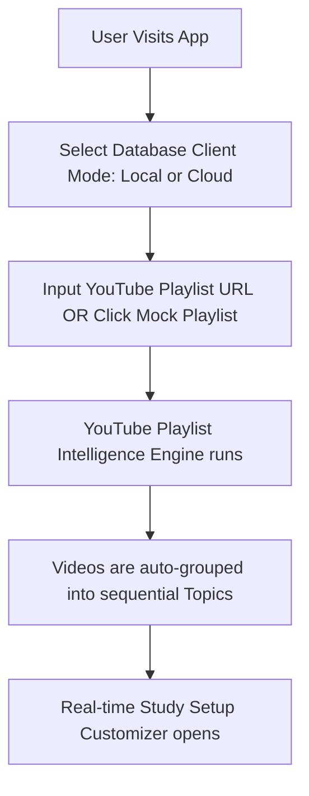
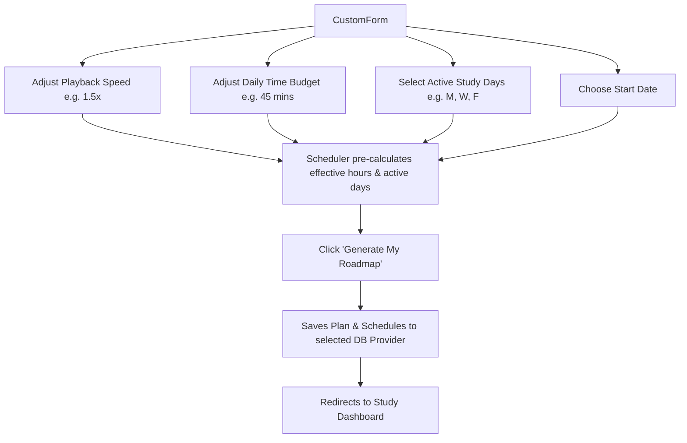
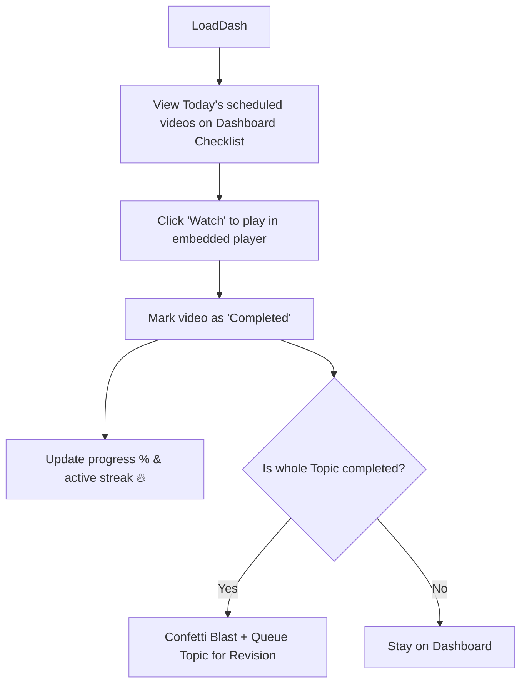
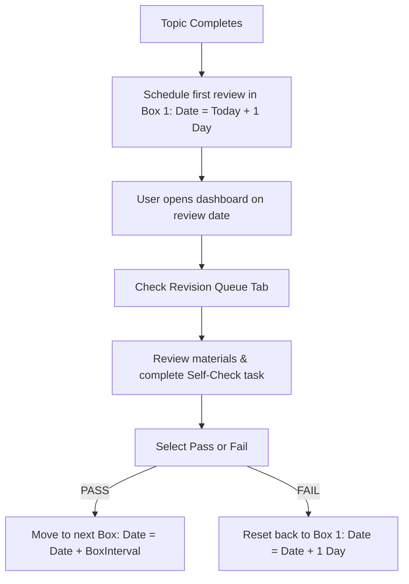

# 🎬 YouTube Playlist Planner

> Transform chaotic YouTube playlists into structured, gamified learning journeys with spaced repetition.

The **YouTube Playlist Planner** is a productivity-focused web application designed to help self-directed learners master YouTube content efficiently. It solves the problem of unstructured playlists by automatically grouping videos into topics, distributing them across personalized study schedules, tracking progress with gamification, and reinforcing learning through spaced repetition.

**Key Problem Solved**: YouTube playlists are flat, unstructured lists that lack scheduling tools, progress tracking, and memory retention mechanisms. This app transforms them into intelligent study roadmaps.


---

## 🚀 Quick Start

### 1. Clone & Install
```bash
git clone https://github.com/Nishank018/ytPlaylistPlanner.git
cd ytPlaylistPlanner
npm install
```

### 2. Run Development Server
```bash
npm run dev
```
Open [http://localhost:3000](http://localhost:3000) in your browser.

### 3. Try It Out
- Use a **Mock Playlist** (React, DSA, or Python) for instant demo
- Or paste your own **YouTube Playlist URL** to get started

---

## 📊 Tech Stack

### 1. Playlist Parsing & Auto-Grouping
* **Playlist Metadata Extraction**: Parses public YouTube playlist URLs to extract video titles, descriptions, durations, and thumbnails.
* **Auto-Grouping Heuristics**: Since most playlists do not have structured topics, the system applies grouping rules:
  1. *Pattern Recognition*: Scans video titles for prefix indicators (e.g., `"Module 1"`, `"Section A"`, `"Part 2"`, or `"01 - Introduction"`).
  2. *Fallback Chunking*: If no prefix pattern is detected in $>50\%$ of titles, it groups consecutive videos into topic blocks of up to 4 videos or ~60 minutes of total video duration.
* **Mock Playlists**: Provides pre-loaded mock playlists (*React JS Course for Beginners*, *Data Structures & Algorithms*, and *Introduction to Python*) for offline execution and instant onboarding.

### 2. Personal Study Customization & Scheduler
* **Playback Speed Factor**: Adjusts the *effective duration* of videos:
  $$\text{Effective Duration} = \frac{\text{Actual Duration}}{\text{Playback Speed}}$$
  Supported values: `1.0x`, `1.25x`, `1.5x`, `1.75x`, `2.0x`.
* **Daily Time Budget**: Restricts the maximum learning time (in minutes) scheduled for any single study session.
* **Active Days Selection**: Allows users to select specific days of the week to study (e.g., Monday, Wednesday, Friday).
* **Non-Splitting Calendar Algorithm**: Sequentially maps videos to scheduled study days. To avoid context-switching and split-attention, the algorithm ensures that:
  - The first video allocated to a day is always accepted (even if it exceeds the daily budget on its own) to prevent blockage.
  - Subsequent videos are added only if they fit within the remaining daily budget.
  - If a video doesn't fit the remaining budget, it is deferred entirely to the next study day rather than being split across days.

### 3. Gamified Progress & Streak Tracking
* **Progress Analytics**: Displays progress percentages, speed-adjusted duration watched, and estimated time remaining.
* **Active Streak Tracker**: Tracks consecutive days on which the user completes at least one video. Displays an active flame 🔥 widget with glowing animations for motivation.
* **Milestone Celebrations**: Triggers fullscreen confetti showers and congratulations overlays for critical achievements:
  - First video completed.
  - A topic block fully completed.
  - The entire playlist completed.
  - Achieving 3-day, 7-day, and 14-day study streaks.

### 4. Leitner Spaced Repetition (Revision Engine)
To combat the forgetting curve, the application integrates a Spaced Repetition System (SRS):
* **Automatic Queueing**: When *all* videos in a Topic block are marked complete, the topic is automatically added to the spaced repetition queue.
* **Leitner Box Intervals**:
  - **Box 1 (Review 1)**: 1 Day after completion.
  - **Box 2 (Review 2)**: 3 Days after the last pass.
  - **Box 3 (Review 3)**: 7 Days after the last pass.
  - **Box 4 (Review 4)**: 30 Days after the last pass.
* **Pass/Fail Assessment**:
  - **Pass**: Advances the topic to the next Leitner Box (capping at Box 4).
  - **Fail**: Resets the topic back to Box 1 (re-scheduling the review for the next day).
* **Unified Planner View**: Shows outstanding review tasks on the calendar alongside new video tasks.

## 📊 Tech Stack

- **Frontend**: React 19, Next.js 16.2.7
- **Styling**: Tailwind CSS v4 + PostCSS
- **Database**: Supabase (PostgreSQL) or LocalStorage
- **Animations**: Framer Motion, Canvas Confetti
- **Icons**: Lucide React
- **Language**: TypeScript 5

### Project Structure
```
src/
├── app/                    # Next.js app directory
├── components/
│   ├── features/          # Feature modules (calendar, dashboard, scheduler, etc.)
│   ├── shared/            # Shared components (modals, players)
│   └── ui/                # UI primitives (buttons, inputs, cards, etc.)
├── context/               # React Context (PlannerContext)
├── hooks/                 # Custom hooks (useRevision)
├── lib/
│   ├── db/               # Database abstraction layer
│   └── youtube/          # YouTube playlist parsing & scheduling
├── styles/               # Global styles
└── types/                # TypeScript definitions
```

---

## ✨ Core Features

---

## 📦 Detailed Setup & Configuration

### Prerequisites
- Node.js 20+ and npm (or yarn/pnpm/bun)
- A YouTube playlist URL (or use built-in mock playlists)
- (Optional) Supabase project for cloud storage

### Installation Steps

#### 1. Clone and Install Dependencies
```bash
git clone https://github.com/Nishank018/ytPlaylistPlanner.git
cd ytPlaylistPlanner
npm install
```

#### 2. Available npm Scripts
| Command | Purpose |
|---------|---------|
| `npm run dev` | Start development server on `http://localhost:3000` (hot-reloading) |
| `npm run build` | Build for production (type-checked and optimized) |
| `npm run start` | Start production server |
| `npm run lint` | Run ESLint checks |

#### 3. Database Configuration

The app **automatically detects** which database to use:

**Local Mode (Default - No Configuration Needed)**
```bash
npm run dev
# Runs entirely offline using browser LocalStorage
# Perfect for testing and demo purposes
```

**Cloud Mode (Optional - Requires Supabase)**
Create a `.env.local` file at the project root:
```env
NEXT_PUBLIC_SUPABASE_URL=your-supabase-project-url
NEXT_PUBLIC_SUPABASE_ANON_KEY=your-supabase-anon-key
```

Then restart the development server:
```bash
npm run dev
```

#### 4. Supabase Setup (Optional)

If you want to use cloud storage, follow these steps:

1. **Create a Supabase account** at [supabase.com](https://supabase.com)
2. **Create a new project** and get your project URL and anon key from settings
3. **Run the SQL Migration** in Supabase's SQL Editor:
   - Copy the entire SQL schema from the README section below (Tables: profiles, playlists, topics, videos, etc.)
   - Paste and execute it in your Supabase SQL Editor
4. **Configure environment variables** as shown above
5. **Restart the app** - it will now use Supabase for persistent storage

```sql
-- Enable UUID extension if not enabled
CREATE EXTENSION IF NOT EXISTS "uuid-ossp";

-- 1. Profiles Table (Linked to Supabase Auth.users)
CREATE TABLE public.profiles (
    id UUID PRIMARY KEY REFERENCES auth.users(id) ON DELETE CASCADE,
    email TEXT NOT NULL,
    display_name TEXT,
    settings JSONB NOT NULL DEFAULT '{
        "playback_speed": 1.0,
        "daily_time_budget": 45,
        "active_days": [1, 2, 3, 4, 5],
        "theme": "system"
    }'::jsonb,
    streak_count INTEGER NOT NULL DEFAULT 0,
    last_active_date DATE,
    created_at TIMESTAMP WITH TIME ZONE DEFAULT timezone('utc'::text, now()) NOT NULL,
    updated_at TIMESTAMP WITH TIME ZONE DEFAULT timezone('utc'::text, now()) NOT NULL
);

-- 2. Playlists Table
CREATE TABLE public.playlists (
    id UUID PRIMARY KEY DEFAULT uuid_generate_v4(),
    user_id UUID NOT NULL REFERENCES public.profiles(id) ON DELETE CASCADE,
    youtube_playlist_id TEXT,
    title TEXT NOT NULL,
    description TEXT,
    thumbnail_url TEXT,
    total_videos INTEGER NOT NULL DEFAULT 0,
    total_duration INTEGER NOT NULL DEFAULT 0, -- In seconds (actual sum)
    difficulty_level TEXT DEFAULT 'Beginner',
    created_at TIMESTAMP WITH TIME ZONE DEFAULT timezone('utc'::text, now()) NOT NULL,
    updated_at TIMESTAMP WITH TIME ZONE DEFAULT timezone('utc'::text, now()) NOT NULL
);

-- 3. Topics Table
CREATE TABLE public.topics (
    id UUID PRIMARY KEY DEFAULT uuid_generate_v4(),
    playlist_id UUID NOT NULL REFERENCES public.playlists(id) ON DELETE CASCADE,
    name TEXT NOT NULL,
    sequence_order INTEGER NOT NULL,
    description TEXT,
    created_at TIMESTAMP WITH TIME ZONE DEFAULT timezone('utc'::text, now()) NOT NULL,
    updated_at TIMESTAMP WITH TIME ZONE DEFAULT timezone('utc'::text, now()) NOT NULL,
    UNIQUE (playlist_id, sequence_order)
);

-- 4. Videos Table
CREATE TABLE public.videos (
    id UUID PRIMARY KEY DEFAULT uuid_generate_v4(),
    playlist_id UUID NOT NULL REFERENCES public.playlists(id) ON DELETE CASCADE,
    topic_id UUID REFERENCES public.topics(id) ON DELETE SET NULL,
    youtube_video_id TEXT NOT NULL,
    title TEXT NOT NULL,
    duration INTEGER NOT NULL DEFAULT 0, -- In seconds
    sequence_order INTEGER NOT NULL,
    thumbnail_url TEXT,
    completed BOOLEAN NOT NULL DEFAULT FALSE,
    completed_at TIMESTAMP WITH TIME ZONE,
    created_at TIMESTAMP WITH TIME ZONE DEFAULT timezone('utc'::text, now()) NOT NULL,
    updated_at TIMESTAMP WITH TIME ZONE DEFAULT timezone('utc'::text, now()) NOT NULL,
    UNIQUE (playlist_id, sequence_order)
);

-- 5. Roadmap Plans Table
CREATE TABLE public.roadmap_plans (
    id UUID PRIMARY KEY DEFAULT uuid_generate_v4(),
    playlist_id UUID NOT NULL REFERENCES public.playlists(id) ON DELETE CASCADE,
    user_id UUID NOT NULL REFERENCES public.profiles(id) ON DELETE CASCADE,
    start_date DATE NOT NULL,
    playback_speed NUMERIC(3, 2) NOT NULL DEFAULT 1.00,
    daily_time_budget INTEGER NOT NULL, -- In minutes
    active_days INTEGER[] NOT NULL,
    created_at TIMESTAMP WITH TIME ZONE DEFAULT timezone('utc'::text, now()) NOT NULL,
    updated_at TIMESTAMP WITH TIME ZONE DEFAULT timezone('utc'::text, now()) NOT NULL
);

-- 6. Daily Schedules Table
CREATE TABLE public.daily_schedules (
    id UUID PRIMARY KEY DEFAULT uuid_generate_v4(),
    roadmap_plan_id UUID NOT NULL REFERENCES public.roadmap_plans(id) ON DELETE CASCADE,
    date DATE NOT NULL,
    duration_budget INTEGER NOT NULL, -- In seconds (adjusted for speed)
    duration_scheduled INTEGER NOT NULL DEFAULT 0, -- In seconds (adjusted sum of videos)
    completed BOOLEAN NOT NULL DEFAULT FALSE,
    created_at TIMESTAMP WITH TIME ZONE DEFAULT timezone('utc'::text, now()) NOT NULL,
    UNIQUE (roadmap_plan_id, date)
);

-- 7. Daily Schedule Videos Table (Association mapping video tasks to specific days)
CREATE TABLE public.daily_schedule_videos (
    id UUID PRIMARY KEY DEFAULT uuid_generate_v4(),
    daily_schedule_id UUID NOT NULL REFERENCES public.daily_schedules(id) ON DELETE CASCADE,
    video_id UUID NOT NULL REFERENCES public.videos(id) ON DELETE CASCADE,
    sequence_order INTEGER NOT NULL,
    created_at TIMESTAMP WITH TIME ZONE DEFAULT timezone('utc'::text, now()) NOT NULL,
    UNIQUE (daily_schedule_id, video_id)
);

-- 8. Revision Sessions Table (Spaced Repetition engine tracker)
CREATE TABLE public.revision_sessions (
    id UUID PRIMARY KEY DEFAULT uuid_generate_v4(),
    user_id UUID NOT NULL REFERENCES public.profiles(id) ON DELETE CASCADE,
    topic_id UUID NOT NULL REFERENCES public.topics(id) ON DELETE CASCADE,
    interval_step INTEGER NOT NULL DEFAULT 0, -- Leitner steps: 0, 1, 2, 3, 4
    next_review_date DATE NOT NULL,
    last_review_date DATE,
    status TEXT NOT NULL DEFAULT 'pending', -- 'pending', 'passed', 'failed'
    created_at TIMESTAMP WITH TIME ZONE DEFAULT timezone('utc'::text, now()) NOT NULL,
    updated_at TIMESTAMP WITH TIME ZONE DEFAULT timezone('utc'::text, now()) NOT NULL,
    UNIQUE (user_id, topic_id)
);

-- 9. Progress Logs Table
CREATE TABLE public.progress_logs (
    id UUID PRIMARY KEY DEFAULT uuid_generate_v4(),
    user_id UUID NOT NULL REFERENCES public.profiles(id) ON DELETE CASCADE,
    video_id UUID NOT NULL REFERENCES public.videos(id) ON DELETE CASCADE,
    watched_at TIMESTAMP WITH TIME ZONE DEFAULT timezone('utc'::text, now()) NOT NULL,
    duration_watched INTEGER NOT NULL, -- in seconds
    created_at TIMESTAMP WITH TIME ZONE DEFAULT timezone('utc'::text, now()) NOT NULL
);

-- --- Database Optimization Indexes ---
CREATE INDEX idx_playlists_user ON public.playlists(user_id);
CREATE INDEX idx_topics_playlist ON public.topics(playlist_id);
CREATE INDEX idx_videos_topic ON public.videos(topic_id);
CREATE INDEX idx_videos_playlist ON public.videos(playlist_id);
CREATE INDEX idx_roadmap_plans_user ON public.roadmap_plans(user_id);
CREATE INDEX idx_daily_schedules_plan ON public.daily_schedules(roadmap_plan_id);
CREATE INDEX idx_daily_schedules_date ON public.daily_schedules(date);
CREATE INDEX idx_daily_schedule_videos_schedule ON public.daily_schedule_videos(daily_schedule_id);
CREATE INDEX idx_revision_sessions_user_date ON public.revision_sessions(user_id, next_review_date);
CREATE INDEX idx_progress_logs_user_video ON public.progress_logs(user_id, video_id);

-- --- Row-Level Security (RLS) policies ---
ALTER TABLE public.profiles ENABLE ROW LEVEL SECURITY;
ALTER TABLE public.playlists ENABLE ROW LEVEL SECURITY;
ALTER TABLE public.topics ENABLE ROW LEVEL SECURITY;
ALTER TABLE public.videos ENABLE ROW LEVEL SECURITY;
ALTER TABLE public.roadmap_plans ENABLE ROW LEVEL SECURITY;
ALTER TABLE public.daily_schedules ENABLE ROW LEVEL SECURITY;
ALTER TABLE public.daily_schedule_videos ENABLE ROW LEVEL SECURITY;
ALTER TABLE public.revision_sessions ENABLE ROW LEVEL SECURITY;
ALTER TABLE public.progress_logs ENABLE ROW LEVEL SECURITY;

CREATE POLICY "Users can view own profile" ON public.profiles FOR SELECT USING (auth.uid() = id);
CREATE POLICY "Users can update own profile" ON public.profiles FOR UPDATE USING (auth.uid() = id);
CREATE POLICY "Users can operate on own playlists" ON public.playlists FOR ALL USING (auth.uid() = user_id);

CREATE POLICY "Users can view topics of their playlists" ON public.topics FOR SELECT USING (EXISTS (
    SELECT 1 FROM public.playlists WHERE playlists.id = topics.playlist_id AND playlists.user_id = auth.uid()
));
CREATE POLICY "Users can modify topics of their playlists" ON public.topics FOR ALL USING (EXISTS (
    SELECT 1 FROM public.playlists WHERE playlists.id = topics.playlist_id AND playlists.user_id = auth.uid()
));

CREATE POLICY "Users can view videos of their playlists" ON public.videos FOR SELECT USING (EXISTS (
    SELECT 1 FROM public.playlists WHERE playlists.id = videos.playlist_id AND playlists.user_id = auth.uid()
));
CREATE POLICY "Users can modify videos of their playlists" ON public.videos FOR ALL USING (EXISTS (
    SELECT 1 FROM public.playlists WHERE playlists.id = videos.playlist_id AND playlists.user_id = auth.uid()
));

CREATE POLICY "Users can manage own roadmap plans" ON public.roadmap_plans FOR ALL USING (auth.uid() = user_id);

CREATE POLICY "Users can view daily schedules of their roadmaps" ON public.daily_schedules FOR SELECT USING (EXISTS (
    SELECT 1 FROM public.roadmap_plans WHERE roadmap_plans.id = daily_schedules.roadmap_plan_id AND roadmap_plans.user_id = auth.uid()
));
CREATE POLICY "Users can modify daily schedules of their roadmaps" ON public.daily_schedules FOR ALL USING (EXISTS (
    SELECT 1 FROM public.roadmap_plans WHERE roadmap_plans.id = daily_schedules.roadmap_plan_id AND roadmap_plans.user_id = auth.uid()
));

CREATE POLICY "Users can manage daily schedule videos" ON public.daily_schedule_videos FOR ALL USING (EXISTS (
    SELECT 1 FROM public.daily_schedules JOIN public.roadmap_plans ON daily_schedules.roadmap_plan_id = roadmap_plans.id
    WHERE daily_schedules.id = daily_schedule_videos.daily_schedule_id AND roadmap_plans.user_id = auth.uid()
));

CREATE POLICY "Users can manage own revision sessions" ON public.revision_sessions FOR ALL USING (auth.uid() = user_id);
CREATE POLICY "Users can manage own progress logs" ON public.progress_logs FOR ALL USING (auth.uid() = user_id);
```

---

## Dynamic User Flows

The application guides the user through the following transitions:

### 1. Onboarding & Input Flow


### 2. Customized Planning Flow


### 3. Study & Progress Loop


### 4. Spaced Repetition Revision Loop

