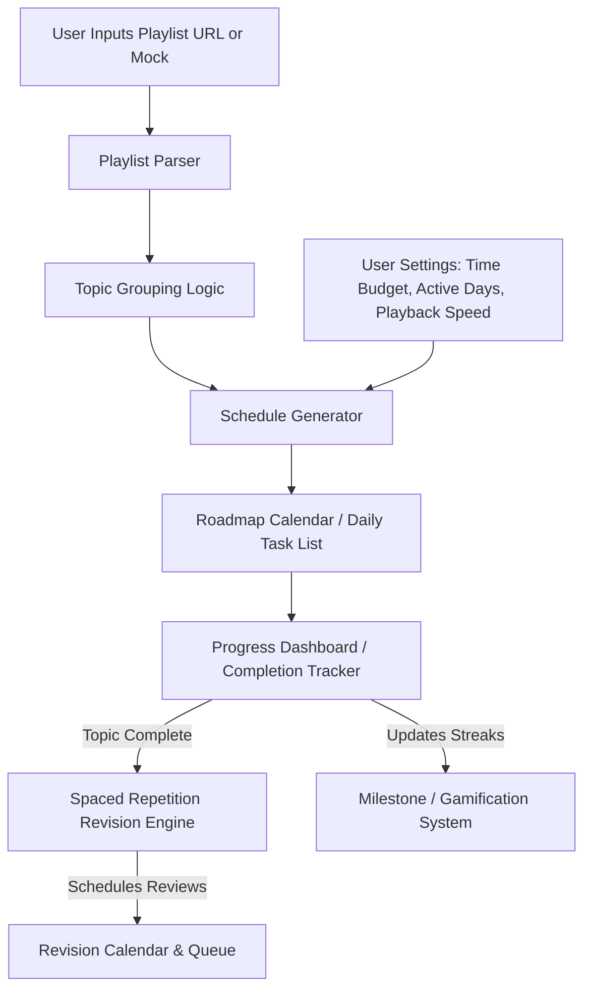

# Product Requirements Document (PRD)

## Project: YouTube Playlist Planner

---

## 1. Document Control & Overview

### 1.1 Executive Summary
Self-directed learners frequently use YouTube playlists (e.g., tutorials, university lectures, programming bootcamps) for education. However, YouTube lacks structured tools to help learners plan their studies around their personal schedules, track granular progress, prevent "split-topic" context switching, or combat the forgetting curve. 

The **YouTube Playlist Planner** is a web-based client-side application designed to solve this. It parses YouTube playlists, categorizes videos into logical topics, calculates personalized daily learning schedules based on user availability, and automates spaced repetition reviews to ensure long-term retention.

### 1.2 Target Audience
* **Self-Taught Developers / Professionals**: Individuals learning new skills while balancing a full-time job.
* **Students**: Learners reviewing academic playlists who need a structured daily study plan.
* **Lifelong Learners**: Individuals seeking to systematically complete educational video series.

### 1.3 Key Objectives
* **Onboarding Speed**: Allow users to generate a customized roadmap within 30 seconds of pasting a URL or choosing a sample playlist.
* **Cognitive Continuity**: Minimize daily topic-splitting to ensure cohesive learning days.
* **Retention Boost**: Incorporate a simplified Leitner/Spaced-Repetition system to prompt periodic review of completed concepts.
* **High Motivation**: Maintain engagement via streak tracking, visual milestones, and celebration animations.

---

## 2. User Personas & User Stories

### 2.1 User Personas

#### Persona A: Sarah (The Busy Career Transitioner)
* **Profile**: 29 years old, transitioning from marketing to software engineering.
* **Constraints**: Works 9-to-5, has 45 minutes of study time on Monday, Wednesday, and Friday evenings.
* **Pain Points**: Gets overwhelmed by a 40-hour playlist. Doesn't know how many videos she can watch in 45 minutes, often stops mid-concept, and forgets what she learned on Monday by the time Friday arrives.

#### Persona B: Alex (The Speed-Learner Student)
* **Profile**: 21-year-old computer science student preparing for technical interviews.
* **Constraints**: Can dedicate 2 hours every day, watches videos at 1.5x speed.
* **Pain Points**: Wants to breeze through a Data Structures playlist, needs a fast tracking system, and wants to review complex topics (like Dynamic Programming) exactly when memory starts to fade.

---

### 2.2 User Stories

| ID | User Role | Action | Benefit | Priority (MoSCoW) |
|---|---|---|---|---|
| **US-01** | Learner | Input a YouTube playlist URL or choose a sample playlist | Retrieve playlist structure without configuration | Must Have |
| **US-02** | Learner | Customize daily study time budget, active days, and video playback speed | Get a schedule tailored to my lifestyle and learning speed | Must Have |
| **US-03** | Learner | See videos organized into logical "Topics" (e.g., videos 1-5 = Introduction) | Understand the high-level outline of the course before starting | Must Have |
| **US-04** | Learner | View a daily calendar/list showing exactly what videos to watch each day | Follow a clear daily roadmap without manual scheduling | Must Have |
| **US-05** | Learner | Toggle video completion status | Keep track of my learning state and progress percentage | Must Have |
| **US-06** | Learner | See my active learning streak and milestones achieved | Stay motivated to study regularly | Should Have |
| **US-07** | Learner | Have finished topics scheduled automatically for spaced repetition reviews | Retain knowledge long-term and know when to revise | Should Have |
| **US-08** | Learner | View upcoming revision tasks on my calendar/dashboard | Integrate reviews seamlessly into my daily study routine | Should Have |

---

## 3. System Architecture & High-Level Flow

The diagram below outlines the flow of data from input to daily schedule and the subsequent progress tracking cycle.



---

## 4. Feature Specifications

### 4.1 Playlist Input & Analysis (Module 1)
* **URL Parsing**: The user inputs a public YouTube playlist URL. The system extracts the metadata (Video Title, Duration, Thumbnail, Video ID).
* **Mock Playlists**: To enable immediate testing or offline execution, the application must provide at least three pre-loaded mock playlists:
  1. *React JS Course for Beginners* (25 videos, varying durations, structured sections).
  2. *Data Structures & Algorithms* (15 videos, longer duration, conceptual sections).
  3. *Introduction to Python* (10 videos, short durations, beginner-friendly).
* **Topic Auto-Grouping**: Since playlists are often flat lists, the system will apply grouping rules:
  1. *Pattern Heuristics*: Group videos based on title matching (e.g., prefix indicators like "Module 1:", "Part 2 -", "#3", or keyword groupings).
  2. *Fallback Chunks*: If no strong title pattern matches, group videos into consecutive blocks of $N$ videos (defaulting to 4 videos or ~60 minutes total duration per topic block).
  3. *User Editing (Optional for MVP)*: Allow users to adjust topic boundaries.

### 4.2 Study Customization & Scheduler (Module 2)
* **Playback Speed Factor**: Adjusts the *effective duration* of videos. 
  $$\text{Effective Duration} = \frac{\text{Actual Duration}}{\text{Playback Speed}}$$
  *Supported values*: 1.0x, 1.25x, 1.5x, 1.75x, 2.0x.
* **Daily Time Budget**: The maximum study time (in minutes) a user wants to spend on active days.
* **Active Days Selection**: Multi-select for days of the week (e.g., Monday, Wednesday, Friday).
* **Calendar Distribution Algorithm**:
  * **Rule 1 (Cohesion / Minimizing Splits)**: If a topic's remaining duration fits within the current day's remaining time budget, place it entirely in that day.
  * **Rule 2 (No Split Interruptions)**: If a single video exceeds the remaining budget for Day $T$, push it to Day $T+1$ (assuming it fits the total daily budget). Do not split a single video across multiple days unless the video length exceeds the daily budget itself.
  * **Rule 3 (Topic Continuity)**: When a topic is split across days, keep the sequence continuous. Do not mix videos from another topic into the middle of an incomplete topic.

### 4.3 Progress Dashboard & Streak Tracking (Module 3)
* **Interactive Checklist**: A nested checklist of Topics -> Videos. Checking off a video updates the overall progress.
* **Analytics Metrics**:
  * **Progress Percentage**: Calculated as $\frac{\text{Completed Video Duration}}{\text{Total Video Duration}} \times 100$.
  * **Time Metrics**: Displays "Time Completed" (adjusted for speed) and "Estimated Time Remaining".
  * **Active Streak Tracker**:
    * Calculated as the number of consecutive calendar days on which the user completes at least one video.
    * Displayed with a fire emoji 🔥 and a streak counter.
* **Milestone Celebrations**: Trigger fullscreen confetti animations and congratulatory modal overlays when:
  * First video is completed.
  * A topic block is fully completed.
  * The entire playlist is completed.
  * 3-day, 7-day, and 14-day streaks are hit.

### 4.4 Revision Engine / Spaced Repetition (Module 4)
To ensure long-term retention of parsed subjects, the planner integrates a Spaced Repetition System (SRS).

* **Trigger**: The moment *all* videos in a Topic block are marked as completed, the topic is added to the Spaced Repetition queue.
* **Interval Intervals**:
  * **Review 1**: 1 Day after completion.
  * **Review 2**: 3 Days after Review 1.
  * **Review 3**: 7 Days after Review 2.
  * **Review 4**: 30 Days after Review 3.
* **Revision Action**:
  * The user is prompted with a dedicated "Pending Reviews" list on their dashboard.
  * The user performs a review (e.g., self-quizzing, summarizing notes for that topic) and marks the review as **Pass** or **Fail**.
  * **Pass**: Advance to the next interval.
  * **Fail**: Reset the interval back to Review 1 (next day).
* **Calendar View**: A secondary calendar overlay or indicator showing scheduled revision tasks alongside new watch tasks.

```
Topic Completed ──> Schedule Review 1 (Day +1)
                      │
            ┌─────────┴─────────┐
          Pass                Fail
            │                   │
  Schedule Review 2 (Day +3)   Reset to Review 1 (Day +1)
```

---

## 5. Non-Functional Requirements

### 5.1 Technology Stack & Deployment
* **Framework**: React.js / Next.js or Vanilla HTML5/CSS3/JavaScript (TailwindCSS preferred for modern UI styling).
* **Data Storage**: Client-side `localStorage` or `IndexedDB`. No external database configuration required for MVP.
* **Offline Compatibility**: All scheduler and tracking logic must function fully offline using the mock playlists.

### 5.2 Performance & UI/UX
* **Scheduler Execution Time**: The algorithm must generate a 30-day schedule in less than 100ms.
* **Responsive Design**: Mobile-first layout to allow users to tick off items on their phones while watching YouTube on their laptops/TVs.
* **Theme Support**: Default system dark/light mode integration.

---

## 6. Acceptance Criteria

### Feature 1: Playlist Parsing & Grouping
```gherkin
Scenario: Parsing a valid playlist URL
  Given the user is on the homepage
  When the user inputs a valid playlist URL and clicks "Analyze"
  Then the system displays the total video count, total duration, and splits the videos into named topic blocks
  And the system highlights the default estimated difficulty level

Scenario: Using mock data when offline
  Given the user has no internet connection
  When the user selects the "React JS Course for Beginners" mock playlist
  Then the system immediately populates the planner with 25 pre-defined videos grouped into 5 topics
```

### Feature 2: Schedule Generation
```gherkin
Scenario: Applying custom playback speed and daily budget
  Given a mock playlist with a total actual duration of 120 minutes
  When the user sets the playback speed to 2.0x
  And the daily time budget to 30 minutes
  And selects Monday, Wednesday, and Friday as active days
  Then the system calculates the effective duration as 60 minutes
  And generates a schedule spanning exactly 2 active days (30 mins per day)
  And schedules these tasks on the upcoming Monday and Wednesday
```

### Feature 3: Spaced Repetition (Revision Engine)
```gherkin
Scenario: Completing a topic schedules a review
  Given the user completes the final video in the "DOM Manipulation" topic on June 1st
  When the progress is updated
  Then the system adds "Review: DOM Manipulation" to the task list for June 2nd (Day +1)

Scenario: Failing a scheduled review
  Given a user has an active review for "CSS Grid" (Interval: 7 Days)
  When the user marks the review as "Failed"
  Then the next review for "CSS Grid" is scheduled for the next calendar day (Day +1)
```

---

## 7. Future Scope (Post-MVP)
* **YouTube Data API Integration**: Real-time OAuth to fetch users' personal private playlists and update watch progress directly back to YouTube.
* **Custom Notes**: Rich-text notes linked directly to specific timestamps within the YouTube video player.
* **Study Groups & Export**: Export schedule to Google Calendar/iCal, and share learning roadmaps with peers.
