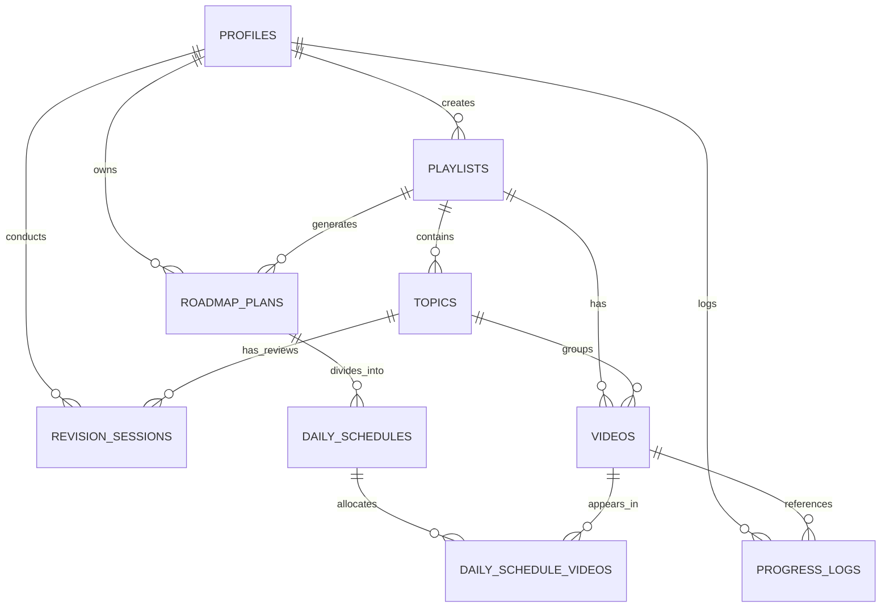

# System Architecture Document (SAD)

## Project: YouTube Playlist Planner
**Author**: System Architect Agent  
**Status**: APPROVED  
**Date**: 2026-06-05  

---

## 1. Executive Summary & Architectural Overview

The **YouTube Playlist Planner** is designed as a hybrid-capable client-focused web application. It operates under two database adapter configurations:
1. **Cloud Mode (Supabase/PostgreSQL)**: Fully persistent, multi-user storage utilizing Supabase Auth and Database services.
2. **Local Mode (LocalStorage/Mock Client)**: Fully client-side, zero-install mode that works offline using a LocalStorage fallback.

To achieve this flexibility, the application employs the **Provider Pattern** and a **Database Client Abstraction Layer**. The frontend core references a unified interface, while a factory determines at runtime whether to load the Supabase client or the LocalStorage client.

### 1.1 High-Level Architecture Diagram

```mermaid
graph TD
    subgraph Presentation Layer (Next.js)
        UI[Page Views & Components]
        State[React Context / State]
    end

    subgraph Service Layer (Business Logic)
        Parser[YouTube Playlist Parser]
        Grouper[Topic Auto-Grouping Engine]
        Scheduler[Daily Calendar Scheduler]
        SRSEngine[Spaced Repetition SRS Engine]
    end

    subgraph Abstraction Layer
        DBInterface["IDatabaseClient (Interface)"]
    end

    subgraph Data Layer
        DBFactory[Database Client Factory]
        SupaClient[Supabase Client Adapter]
        LocalClient[LocalStorage Client Adapter]
        SupabaseDB[("Supabase (PostgreSQL)")]
        LocalDB[("Local Storage (JSON)")]
    end

    UI --> State
    State --> Parser
    State --> Grouper
    State --> Scheduler
    State --> SRSEngine
    
    State --> DBInterface
    DBInterface --> DBFactory
    DBFactory --> SupaClient
    DBFactory --> LocalClient
    
    SupaClient --> SupabaseDB
    LocalClient --> LocalDB
```

---

## 2. Database Schema (PostgreSQL)

The database schema is structured for PostgreSQL. All tables are created in the `public` schema. Foreign keys include cascading rules to prevent orphaned records when a user deletes a playlist.

### 2.1 Entity Relationship Diagram (ERD)



### 2.2 SQL DDL Schema Definition

```sql
-- Enable UUID extension if not enabled
CREATE EXTENSION IF NOT EXISTS "uuid-ossp";

-- 1. Profiles Table (Linked to Supabase Auth.users)
CREATE TABLE public.profiles (
    id UUID PRIMARY KEY REFERENCES auth.users(id) ON DELETE CASCADE,
    email TEXT NOT NULL,
    display_name TEXT,
    settings JSONB NOT NULL DEFAULT '{
        "playback_speed": 1.0,
        "daily_time_budget": 45,
        "active_days": [1, 2, 3, 4, 5],
        "theme": "system"
    }'::jsonb,
    streak_count INTEGER NOT NULL DEFAULT 0,
    last_active_date DATE,
    created_at TIMESTAMP WITH TIME ZONE DEFAULT timezone('utc'::text, now()) NOT NULL,
    updated_at TIMESTAMP WITH TIME ZONE DEFAULT timezone('utc'::text, now()) NOT NULL
);

-- 2. Playlists Table
CREATE TABLE public.playlists (
    id UUID PRIMARY KEY DEFAULT uuid_generate_v4(),
    user_id UUID NOT NULL REFERENCES public.profiles(id) ON DELETE CASCADE,
    youtube_playlist_id TEXT, -- Nullable for custom mock playlists
    title TEXT NOT NULL,
    description TEXT,
    thumbnail_url TEXT,
    total_videos INTEGER NOT NULL DEFAULT 0,
    total_duration INTEGER NOT NULL DEFAULT 0, -- In seconds (actual sum)
    difficulty_level TEXT DEFAULT 'Beginner',
    created_at TIMESTAMP WITH TIME ZONE DEFAULT timezone('utc'::text, now()) NOT NULL,
    updated_at TIMESTAMP WITH TIME ZONE DEFAULT timezone('utc'::text, now()) NOT NULL
);

-- 3. Topics Table
CREATE TABLE public.topics (
    id UUID PRIMARY KEY DEFAULT uuid_generate_v4(),
    playlist_id UUID NOT NULL REFERENCES public.playlists(id) ON DELETE CASCADE,
    name TEXT NOT NULL,
    sequence_order INTEGER NOT NULL,
    description TEXT,
    created_at TIMESTAMP WITH TIME ZONE DEFAULT timezone('utc'::text, now()) NOT NULL,
    updated_at TIMESTAMP WITH TIME ZONE DEFAULT timezone('utc'::text, now()) NOT NULL,
    UNIQUE (playlist_id, sequence_order)
);

-- 4. Videos Table
CREATE TABLE public.videos (
    id UUID PRIMARY KEY DEFAULT uuid_generate_v4(),
    playlist_id UUID NOT NULL REFERENCES public.playlists(id) ON DELETE CASCADE,
    topic_id UUID REFERENCES public.topics(id) ON DELETE SET NULL,
    youtube_video_id TEXT NOT NULL,
    title TEXT NOT NULL,
    duration INTEGER NOT NULL DEFAULT 0, -- In seconds (actual)
    sequence_order INTEGER NOT NULL,
    thumbnail_url TEXT,
    completed BOOLEAN NOT NULL DEFAULT FALSE,
    completed_at TIMESTAMP WITH TIME ZONE,
    created_at TIMESTAMP WITH TIME ZONE DEFAULT timezone('utc'::text, now()) NOT NULL,
    updated_at TIMESTAMP WITH TIME ZONE DEFAULT timezone('utc'::text, now()) NOT NULL,
    UNIQUE (playlist_id, sequence_order)
);

-- 5. Roadmap Plans Table
CREATE TABLE public.roadmap_plans (
    id UUID PRIMARY KEY DEFAULT uuid_generate_v4(),
    playlist_id UUID NOT NULL REFERENCES public.playlists(id) ON DELETE CASCADE,
    user_id UUID NOT NULL REFERENCES public.profiles(id) ON DELETE CASCADE,
    start_date DATE NOT NULL,
    playback_speed NUMERIC(3, 2) NOT NULL DEFAULT 1.00,
    daily_time_budget INTEGER NOT NULL, -- In minutes
    active_days INTEGER[] NOT NULL, -- Array of days (0-6, where 0=Sunday)
    created_at TIMESTAMP WITH TIME ZONE DEFAULT timezone('utc'::text, now()) NOT NULL,
    updated_at TIMESTAMP WITH TIME ZONE DEFAULT timezone('utc'::text, now()) NOT NULL
);

-- 6. Daily Schedules Table
CREATE TABLE public.daily_schedules (
    id UUID PRIMARY KEY DEFAULT uuid_generate_v4(),
    roadmap_plan_id UUID NOT NULL REFERENCES public.roadmap_plans(id) ON DELETE CASCADE,
    date DATE NOT NULL,
    duration_budget INTEGER NOT NULL, -- In seconds (adjusted for speed)
    duration_scheduled INTEGER NOT NULL DEFAULT 0, -- In seconds (adjusted sum of videos)
    completed BOOLEAN NOT NULL DEFAULT FALSE,
    created_at TIMESTAMP WITH TIME ZONE DEFAULT timezone('utc'::text, now()) NOT NULL,
    UNIQUE (roadmap_plan_id, date)
);

-- 7. Daily Schedule Videos Table (Association mapping video tasks to specific days)
CREATE TABLE public.daily_schedule_videos (
    id UUID PRIMARY KEY DEFAULT uuid_generate_v4(),
    daily_schedule_id UUID NOT NULL REFERENCES public.daily_schedules(id) ON DELETE CASCADE,
    video_id UUID NOT NULL REFERENCES public.videos(id) ON DELETE CASCADE,
    sequence_order INTEGER NOT NULL,
    created_at TIMESTAMP WITH TIME ZONE DEFAULT timezone('utc'::text, now()) NOT NULL,
    UNIQUE (daily_schedule_id, video_id)
);

-- 8. Revision Sessions Table (Spaced Repetition engine tracker)
CREATE TABLE public.revision_sessions (
    id UUID PRIMARY KEY DEFAULT uuid_generate_v4(),
    user_id UUID NOT NULL REFERENCES public.profiles(id) ON DELETE CASCADE,
    topic_id UUID NOT NULL REFERENCES public.topics(id) ON DELETE CASCADE,
    interval_step INTEGER NOT NULL DEFAULT 0, -- Leitner steps: 0, 1, 2, 3, 4
    next_review_date DATE NOT NULL,
    last_review_date DATE,
    status TEXT NOT NULL DEFAULT 'pending', -- 'pending', 'passed', 'failed'
    created_at TIMESTAMP WITH TIME ZONE DEFAULT timezone('utc'::text, now()) NOT NULL,
    updated_at TIMESTAMP WITH TIME ZONE DEFAULT timezone('utc'::text, now()) NOT NULL,
    UNIQUE (user_id, topic_id)
);

-- 9. Progress Logs Table
CREATE TABLE public.progress_logs (
    id UUID PRIMARY KEY DEFAULT uuid_generate_v4(),
    user_id UUID NOT NULL REFERENCES public.profiles(id) ON DELETE CASCADE,
    video_id UUID NOT NULL REFERENCES public.videos(id) ON DELETE CASCADE,
    watched_at TIMESTAMP WITH TIME ZONE DEFAULT timezone('utc'::text, now()) NOT NULL,
    duration_watched INTEGER NOT NULL, -- in seconds
    created_at TIMESTAMP WITH TIME ZONE DEFAULT timezone('utc'::text, now()) NOT NULL
);
```

### 2.3 Indexes & Performance Optimization
To ensure the scheduler execution and dashboards query in $< 100\text{ms}$, indexing has been set up on all foreign key lookups and queries with sorting or range filtering.

```sql
-- Foreign keys and composite query indexes
CREATE INDEX idx_playlists_user ON public.playlists(user_id);
CREATE INDEX idx_topics_playlist ON public.topics(playlist_id);
CREATE INDEX idx_videos_topic ON public.videos(topic_id);
CREATE INDEX idx_videos_playlist ON public.videos(playlist_id);
CREATE INDEX idx_roadmap_plans_user ON public.roadmap_plans(user_id);
CREATE INDEX idx_daily_schedules_plan ON public.daily_schedules(roadmap_plan_id);
CREATE INDEX idx_daily_schedules_date ON public.daily_schedules(date);
CREATE INDEX idx_daily_schedule_videos_schedule ON public.daily_schedule_videos(daily_schedule_id);
CREATE INDEX idx_revision_sessions_user_date ON public.revision_sessions(user_id, next_review_date);
CREATE INDEX idx_progress_logs_user_video ON public.progress_logs(user_id, video_id);
```

### 2.4 Row-Level Security (RLS) Policies (Supabase Integration)
Security is configured at the row level to isolate user datasets. Only authenticated users can access or mutate their own data.

```sql
-- Enable Row Level Security (RLS) on all tables
ALTER TABLE public.profiles ENABLE ROW LEVEL SECURITY;
ALTER TABLE public.playlists ENABLE ROW LEVEL SECURITY;
ALTER TABLE public.topics ENABLE ROW LEVEL SECURITY;
ALTER TABLE public.videos ENABLE ROW LEVEL SECURITY;
ALTER TABLE public.roadmap_plans ENABLE ROW LEVEL SECURITY;
ALTER TABLE public.daily_schedules ENABLE ROW LEVEL SECURITY;
ALTER TABLE public.daily_schedule_videos ENABLE ROW LEVEL SECURITY;
ALTER TABLE public.revision_sessions ENABLE ROW LEVEL SECURITY;
ALTER TABLE public.progress_logs ENABLE ROW LEVEL SECURITY;

-- Profiles Policies
CREATE POLICY "Users can view own profile" ON public.profiles 
    FOR SELECT USING (auth.uid() = id);
CREATE POLICY "Users can update own profile" ON public.profiles 
    FOR UPDATE USING (auth.uid() = id);

-- Playlists Policies
CREATE POLICY "Users can operate on own playlists" ON public.playlists 
    FOR ALL USING (auth.uid() = user_id);

-- Topics Policies
CREATE POLICY "Users can view topics of their playlists" ON public.topics 
    FOR SELECT USING (EXISTS (
        SELECT 1 FROM public.playlists 
        WHERE playlists.id = topics.playlist_id AND playlists.user_id = auth.uid()
    ));
CREATE POLICY "Users can modify topics of their playlists" ON public.topics 
    FOR ALL USING (EXISTS (
        SELECT 1 FROM public.playlists 
        WHERE playlists.id = topics.playlist_id AND playlists.user_id = auth.uid()
    ));

-- Videos Policies
CREATE POLICY "Users can view videos of their playlists" ON public.videos 
    FOR SELECT USING (EXISTS (
        SELECT 1 FROM public.playlists 
        WHERE playlists.id = videos.playlist_id AND playlists.user_id = auth.uid()
    ));
CREATE POLICY "Users can modify videos of their playlists" ON public.videos 
    FOR ALL USING (EXISTS (
        SELECT 1 FROM public.playlists 
        WHERE playlists.id = videos.playlist_id AND playlists.user_id = auth.uid()
    ));

-- Roadmap Plans Policies
CREATE POLICY "Users can manage own roadmap plans" ON public.roadmap_plans 
    FOR ALL USING (auth.uid() = user_id);

-- Daily Schedules Policies
CREATE POLICY "Users can view daily schedules of their roadmaps" ON public.daily_schedules 
    FOR SELECT USING (EXISTS (
        SELECT 1 FROM public.roadmap_plans 
        WHERE roadmap_plans.id = daily_schedules.roadmap_plan_id AND roadmap_plans.user_id = auth.uid()
    ));
CREATE POLICY "Users can modify daily schedules of their roadmaps" ON public.daily_schedules 
    FOR ALL USING (EXISTS (
        SELECT 1 FROM public.roadmap_plans 
        WHERE roadmap_plans.id = daily_schedules.roadmap_plan_id AND roadmap_plans.user_id = auth.uid()
    ));

-- Daily Schedule Videos Policies
CREATE POLICY "Users can manage daily schedule videos" ON public.daily_schedule_videos 
    FOR ALL USING (EXISTS (
        SELECT 1 FROM public.daily_schedules
        JOIN public.roadmap_plans ON daily_schedules.roadmap_plan_id = roadmap_plans.id
        WHERE daily_schedules.id = daily_schedule_videos.daily_schedule_id AND roadmap_plans.user_id = auth.uid()
    ));

-- Revision Sessions Policies
CREATE POLICY "Users can manage own revision sessions" ON public.revision_sessions 
    FOR ALL USING (auth.uid() = user_id);

-- Progress Logs Policies
CREATE POLICY "Users can manage own progress logs" ON public.progress_logs 
    FOR ALL USING (auth.uid() = user_id);
```

---

## 3. Local Storage Schema (Offline Fallback)

To run without an external database, the data layout inside `localStorage` mimics the PostgreSQL relational model. Values are stored under explicit, prefixed keys.

### 3.1 LocalStorage Keys & Data Structure Examples

#### Key: `ytpp_profile`
```json
{
  "id": "mock-user-1234",
  "email": "offline-user@example.com",
  "displayName": "Offline Learner",
  "settings": {
    "playbackSpeed": 1.5,
    "dailyTimeBudget": 45,
    "activeDays": [1, 3, 5],
    "theme": "dark"
  },
  "streakCount": 3,
  "lastActiveDate": "2026-06-04"
}
```

#### Key: `ytpp_playlists`
```json
[
  {
    "id": "playlist-uuid-1111",
    "userId": "mock-user-1234",
    "youtubePlaylistId": "PL3ZxMufERd1x856b3e_264eKxY43lU5_5",
    "title": "React JS Course for Beginners",
    "description": "Comprehensive tutorial course covering React basics, components, and state.",
    "thumbnailUrl": "https://img.youtube.com/vi/Ke90Tje7VS0/0.jpg",
    "totalVideos": 25,
    "totalDuration": 18000,
    "difficultyLevel": "Beginner",
    "createdAt": "2026-06-05T10:00:00Z",
    "updatedAt": "2026-06-05T10:00:00Z"
  }
]
```

#### Key: `ytpp_topics`
```json
[
  {
    "id": "topic-uuid-intro",
    "playlistId": "playlist-uuid-1111",
    "name": "Introduction & Setup",
    "sequenceOrder": 1,
    "description": "Get familiar with tools and React environment setup.",
    "createdAt": "2026-06-05T10:00:00Z",
    "updatedAt": "2026-06-05T10:00:00Z"
  }
]
```

#### Key: `ytpp_videos`
```json
[
  {
    "id": "video-uuid-1",
    "playlistId": "playlist-uuid-1111",
    "topicId": "topic-uuid-intro",
    "youtubeVideoId": "Ke90Tje7VS0",
    "title": "React JS Introduction",
    "duration": 600,
    "sequenceOrder": 1,
    "thumbnailUrl": "https://img.youtube.com/vi/Ke90Tje7VS0/0.jpg",
    "completed": true,
    "completedAt": "2026-06-05T11:30:00Z",
    "createdAt": "2026-06-05T10:00:00Z",
    "updatedAt": "2026-06-05T11:30:00Z"
  }
]
```

#### Key: `ytpp_roadmaps`
```json
[
  {
    "id": "roadmap-uuid-9999",
    "playlistId": "playlist-uuid-1111",
    "userId": "mock-user-1234",
    "startDate": "2026-06-08",
    "playbackSpeed": 1.5,
    "dailyTimeBudget": 45,
    "activeDays": [1, 3, 5],
    "createdAt": "2026-06-05T10:15:00Z",
    "updatedAt": "2026-06-05T10:15:00Z"
  }
]
```

#### Key: `ytpp_schedules`
```json
[
  {
    "id": "schedule-uuid-day1",
    "roadmapPlanId": "roadmap-uuid-9999",
    "date": "2026-06-08",
    "durationBudget": 2700,
    "durationScheduled": 1800,
    "completed": false,
    "videoIds": ["video-uuid-1", "video-uuid-2"],
    "createdAt": "2026-06-05T10:15:00Z"
  }
]
```

#### Key: `ytpp_revisions`
```json
[
  {
    "id": "revision-uuid-7777",
    "userId": "mock-user-1234",
    "topicId": "topic-uuid-intro",
    "intervalStep": 1,
    "nextReviewDate": "2026-06-06",
    "lastReviewDate": "2026-06-05",
    "status": "pending",
    "createdAt": "2026-06-05T11:30:00Z",
    "updatedAt": "2026-06-05T11:30:00Z"
  }
]
```

#### Key: `ytpp_logs`
```json
[
  {
    "id": "log-uuid-8888",
    "userId": "mock-user-1234",
    "videoId": "video-uuid-1",
    "watchedAt": "2026-06-05T11:30:00Z",
    "durationWatched": 600,
    "createdAt": "2026-06-05T11:30:00Z"
  }
]
```

---

## 4. API Contracts & TypeScript Interfaces

Below are the TypeScript definitions governing models across both implementation adapters.

```typescript
// ==========================================
// 1. Core Domains & Entities
// ==========================================

export type ThemeType = 'light' | 'dark' | 'system';

export interface UserSettings {
  playbackSpeed: number; // 1.0, 1.25, 1.5, 1.75, 2.0
  dailyTimeBudget: number; // in minutes
  activeDays: number[]; // 0 = Sunday, 1 = Monday, etc.
  theme: ThemeType;
}

export interface UserProfile {
  id: string;
  email: string;
  displayName?: string;
  settings: UserSettings;
  streakCount: number;
  lastActiveDate?: string; // YYYY-MM-DD
  createdAt: string;
  updatedAt: string;
}

export interface Playlist {
  id: string;
  userId: string;
  youtubePlaylistId?: string; // undefined for manual/custom mock lists
  title: string;
  description?: string;
  thumbnailUrl?: string;
  totalVideos: number;
  totalDuration: number; // in seconds (actual duration, speed adjustments made on display/calculation)
  difficultyLevel: 'Beginner' | 'Intermediate' | 'Advanced';
  createdAt: string;
  updatedAt: string;
}

export interface Topic {
  id: string;
  playlistId: string;
  name: string;
  sequenceOrder: number;
  description?: string;
  createdAt: string;
  updatedAt: string;
}

export interface Video {
  id: string;
  playlistId: string;
  topicId?: string; // reference to grouped topic block
  youtubeVideoId: string;
  title: string;
  duration: number; // in seconds (actual)
  sequenceOrder: number; // ordering index inside the playlist
  thumbnailUrl?: string;
  completed: boolean;
  completedAt?: string;
  createdAt: string;
  updatedAt: string;
}

export interface RoadmapPlan {
  id: string;
  playlistId: string;
  userId: string;
  startDate: string; // YYYY-MM-DD
  playbackSpeed: number; // setting value used at schedule creation
  dailyTimeBudget: number; // setting value used at schedule creation (minutes)
  activeDays: number[]; // setting value used at schedule creation
  createdAt: string;
  updatedAt: string;
}

export interface DailySchedule {
  id: string;
  roadmapPlanId: string;
  date: string; // YYYY-MM-DD
  durationBudget: number; // in seconds
  durationScheduled: number; // in seconds, adjusted for speed
  completed: boolean;
  videoIds: string[]; // List of reference video IDs scheduled for this day
  createdAt: string;
}

export type RevisionStatus = 'pending' | 'passed' | 'failed';

export interface RevisionSession {
  id: string;
  userId: string;
  topicId: string;
  intervalStep: number; // Leitner Steps (0 to 4)
  nextReviewDate: string; // YYYY-MM-DD
  lastReviewDate?: string; // YYYY-MM-DD
  status: RevisionStatus;
  createdAt: string;
  updatedAt: string;
}

export interface ProgressLog {
  id: string;
  userId: string;
  videoId: string;
  watchedAt: string;
  durationWatched: number; // seconds
  createdAt: string;
}

// Helper types for client analytics views
export interface ProgressStats {
  percentageComplete: number;
  totalVideosCount: number;
  completedVideosCount: number;
  actualDurationTotal: number; // seconds
  speedAdjustedDurationTotal: number; // seconds
  durationCompleted: number; // seconds
  speedAdjustedDurationCompleted: number; // seconds
  estimatedTimeRemaining: number; // seconds (adjusted for speed)
}

export interface RevisionTask {
  id: string; // RevisionSession ID
  topicName: string;
  topicId: string;
  playlistTitle: string;
  intervalStep: number;
  nextReviewDate: string;
}
```

---

## 5. Database Client Abstraction Layer

The frontend components access the storage layer exclusively through the `IDatabaseClient` interface. An environment check handles initialization.

```typescript
export interface IDatabaseClient {
  // --- Profile & Authentication ---
  getCurrentUser(): Promise<UserProfile | null>;
  getUserProfile(userId: string): Promise<UserProfile | null>;
  updateUserProfile(userId: string, profile: Partial<UserProfile>): Promise<UserProfile>;
  updateUserStreak(userId: string): Promise<{ streakCount: number; lastActiveDate: string }>;

  // --- Playlist Management ---
  createPlaylist(
    playlist: Omit<Playlist, 'id' | 'createdAt' | 'updatedAt'>,
    videos: Omit<Video, 'id' | 'createdAt' | 'updatedAt'>[],
    topics: Omit<Topic, 'id' | 'createdAt' | 'updatedAt'>[]
  ): Promise<Playlist>;
  getPlaylists(userId: string): Promise<Playlist[]>;
  getPlaylistDetails(playlistId: string): Promise<{ playlist: Playlist; topics: Topic[]; videos: Video[] }>;
  deletePlaylist(playlistId: string): Promise<void>;

  // --- Progress Control ---
  updateVideoCompletion(videoId: string, completed: boolean): Promise<Video>;
  logProgress(log: Omit<ProgressLog, 'id' | 'createdAt'>): Promise<ProgressLog>;
  getUserProgressStats(userId: string, playlistId: string): Promise<ProgressStats>;

  // --- Roadmap Planning ---
  createRoadmapPlan(
    plan: Omit<RoadmapPlan, 'id' | 'createdAt' | 'updatedAt'>,
    schedules: Omit<DailySchedule, 'id' | 'createdAt'>[]
  ): Promise<RoadmapPlan>;
  getRoadmapPlan(playlistId: string): Promise<{ plan: RoadmapPlan; schedules: DailySchedule[] } | null>;
  updateDailyScheduleStatus(scheduleId: string, completed: boolean): Promise<DailySchedule>;

  // --- Revision (Spaced Repetition) ---
  getPendingRevisions(userId: string, date: string): Promise<RevisionTask[]>;
  createRevisionSession(session: Omit<RevisionSession, 'id' | 'createdAt' | 'updatedAt'>): Promise<RevisionSession>;
  updateRevisionSession(
    sessionId: string,
    status: 'passed' | 'failed',
    nextReviewDate: string,
    intervalStep: number
  ): Promise<RevisionSession>;
}
```

### 5.1 Factory Adapter Pattern
An implementation pattern checks the presence of environment variables to switch client backends dynamically.

```typescript
// dbClientFactory.ts
import { IDatabaseClient } from './IDatabaseClient';
import { SupabaseDbClient } from './SupabaseDbClient';
import { LocalStorageDbClient } from './LocalStorageDbClient';

class DbClientFactory {
  private static instance: IDatabaseClient | null = null;

  public static getClient(): IDatabaseClient {
    if (this.instance) return this.instance;

    const useSupabase = 
      process.env.NEXT_PUBLIC_SUPABASE_URL && 
      process.env.NEXT_PUBLIC_SUPABASE_ANON_KEY;

    if (useSupabase) {
      console.log("[DbClientFactory] Initializing Cloud Mode (Supabase)");
      this.instance = new SupabaseDbClient();
    } else {
      console.log("[DbClientFactory] Initializing Local Mode (LocalStorage fallback)");
      this.instance = new LocalStorageDbClient();
    }

    return this.instance;
  }
}

export const dbClient = DbClientFactory.getClient();
```

---

## 6. Key Business Logic & Algorithms

### 6.1 Playlist Topic Auto-Grouping Heuristics
When a playlist has flat structures, the parser executes the following rules sequentially:

```typescript
export function groupVideosIntoTopics(videos: Video[], totalPlaylistDuration: number): { topics: Omit<Topic, 'id' | 'createdAt' | 'updatedAt'>[], videoTopicAssignments: Record<number, string> } {
  // 1. Analyze for title prefix patterns (e.g. "Module 1", "Section A", "Part 3", "01 - Introduction")
  const prefixRegexes = [
    /^(?:Module|Section|Part|Chapter)\s+([a-zA-Z0-9]+)/i,
    /^(\d+)\s*[-:]/,
    /^#(\d+)\s*[-:]/
  ];

  let detectedPattern = false;
  // Basic heuristic scan: if > 50% match a specific pattern, use it
  // ...
  
  // 2. Fallback to duration/count chunking if no patterns are found:
  // Target duration per topic: 60 minutes (3600 seconds) OR maximum 4 videos
  const TARGET_TOPIC_DURATION = 3600; 
  const MAX_VIDEOS_PER_TOPIC = 4;

  const topics: Omit<Topic, 'id' | 'createdAt' | 'updatedAt'>[] = [];
  let currentTopicIndex = 1;
  let currentTopicDuration = 0;
  let currentTopicVideosCount = 0;

  // Initialize first topic block
  let currentTopicName = `Topic ${currentTopicIndex}`;

  // Loop through videos to associate sequences
  // ...
}
```

### 6.2 Calendar Distribution Scheduler
The scheduling algorithm maps videos sequentially on target calendar days while ensuring that video split actions are minimized, using settings parameters.

#### Duration Adjustment Formula:
$$\text{Effective Duration} = \frac{\text{Actual Duration}}{\text{Playback Speed}}$$

#### Calendar Algorithm Logic Flow:
```typescript
interface ScheduleInput {
  videos: Video[];
  startDate: string; // YYYY-MM-DD
  playbackSpeed: number;
  dailyTimeBudget: number; // minutes
  activeDays: number[]; // e.g. [1,3,5]
}

export function generateDailySchedules(input: ScheduleInput): Omit<DailySchedule, 'id' | 'createdAt'>[] {
  const schedules: Omit<DailySchedule, 'id' | 'createdAt'>[] = [];
  const dailyBudgetSec = input.dailyTimeBudget * 60;
  
  let currentIdx = 0;
  const videos = [...input.videos].sort((a, b) => a.sequenceOrder - b.sequenceOrder);
  let currentDate = new Date(input.startDate);

  // Helper function to advance to next scheduled learning day
  const advanceToNextActiveDay = (date: Date, activeDays: number[]): Date => {
    const next = new Date(date);
    do {
      next.setDate(next.getDate() + 1);
    } while (!activeDays.includes(next.getDay()));
    return next;
  };

  // Align start date to first active day if it's not currently active
  if (!input.activeDays.includes(currentDate.getDay())) {
    currentDate = advanceToNextActiveDay(currentDate, input.activeDays);
  }

  while (currentIdx < videos.length) {
    let dayVideos: Video[] = [];
    let scheduledSeconds = 0;

    while (currentIdx < videos.length) {
      const video = videos[currentIdx];
      const videoEffDuration = Math.round(video.duration / input.playbackSpeed);

      // Rule 1: First item in the day is always accepted (even if it exceeds the budget by itself)
      if (dayVideos.length === 0) {
        dayVideos.push(video);
        scheduledSeconds += videoEffDuration;
        currentIdx++;
        continue;
      }

      // Rule 2: Check if adding the video exceeds the remaining budget
      const remainingBudget = dailyBudgetSec - scheduledSeconds;
      
      if (videoEffDuration <= remainingBudget) {
        // Fits entirely, add it
        dayVideos.push(video);
        scheduledSeconds += videoEffDuration;
        currentIdx++;
      } else {
        // Rule 3: Single-video splits avoidance
        // If it doesn't fit, defer it entirely to the next scheduled day
        break;
      }
    }

    // Save current daily schedule schedule structure
    schedules.push({
      roadmapPlanId: '', // Filled by the controller/database implementation
      date: currentDate.toISOString().split('T')[0],
      durationBudget: dailyBudgetSec,
      durationScheduled: scheduledSeconds,
      completed: false,
      videoIds: dayVideos.map(v => v.id)
    });

    // Advance date for the next iteration
    if (currentIdx < videos.length) {
      currentDate = advanceToNextActiveDay(currentDate, input.activeDays);
    }
  }

  return schedules;
}
```

### 6.3 Leitner/Spaced Repetition Scheduler Logic
Once a Topic is completed (all related videos marked `completed = true`), it gets queued for spaced repetition. The spaced intervals advance or reset on Pass/Fail answers.

```typescript
const INTERVAL_DAYS = {
  0: 0,   // Initial queue state
  1: 1,   // Review 1 (Day +1)
  2: 3,   // Review 2 (Day +3 from last)
  3: 7,   // Review 3 (Day +7 from last)
  4: 30   // Review 4 (Day +30 from last)
};

export function handleRevisionResult(
  currentStep: number,
  isPass: boolean,
  currentDateStr: string
): { nextStep: number; nextReviewDate: string } {
  let nextStep = currentStep;
  
  if (isPass) {
    // Advance to next step, capped at step 4
    nextStep = Math.min(currentStep + 1, 4);
  } else {
    // Fail: reset back to Step 1 (triggers a review tomorrow)
    nextStep = 1;
  }

  const daysToAdd = INTERVAL_DAYS[nextStep as keyof typeof INTERVAL_DAYS] || 1;
  const nextDate = new Date(currentDateStr);
  nextDate.setDate(nextDate.getDate() + daysToAdd);

  return {
    nextStep,
    nextReviewDate: nextDate.toISOString().split('T')[0]
  };
}
```

---

## 7. Migration & Scalability Roadmap

1. **Local Mode Sync to Cloud Mode**: When an offline user signs up for an account, the DB Adapter layer will call a migration procedure that imports data from LocalStorage keys to Supabase tables.
2. **Batch Insert Optimizations**: Supabase database insertions for large playlists (100+ videos) are processed via bulk statements rather than single request loops to prevent execution latency.
3. **Caching & Real-Time Listeners**: Real-time subscriptions are enabled via Supabase channels for streaks updates, prompting interactive milestone overlays seamlessly.
