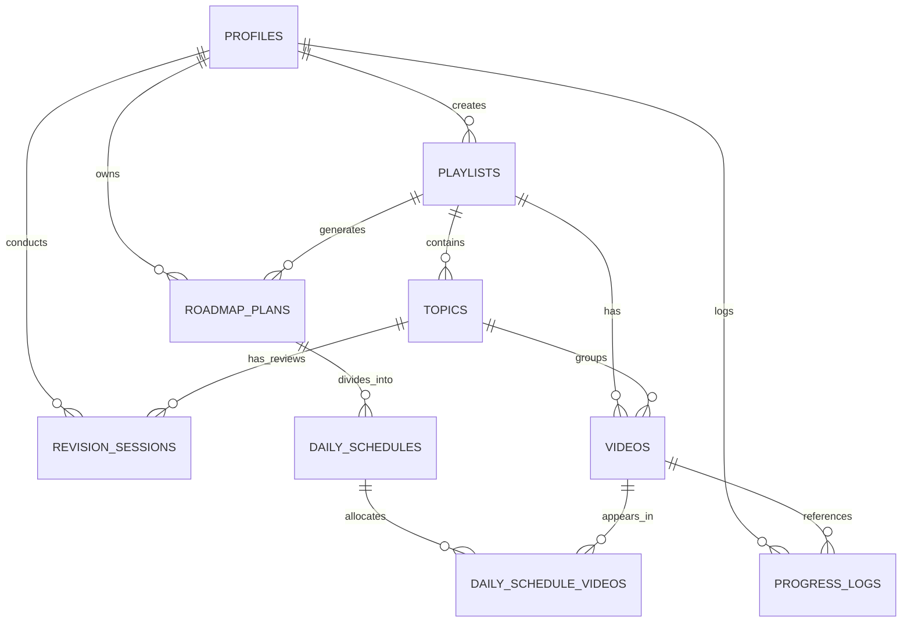

# Developer Documentation

**Author**: Documentation Agent (10)  
**Status**: APPROVED  
**Date**: 2026-06-05  

This document serves as the technical guide for the **YouTube Playlist Planner** codebase. It covers the relational schema, the hybrid Database Factory pattern, the mathematical formulation of the non-splitting calendar budget algorithm, and records the collaboration workflow of the system agents.

---

## 1. Relational Database Schema & Architecture

The YouTube Playlist Planner uses a relational schema designed for PostgreSQL in Cloud Mode and replicated in LocalStorage in Local Mode. 

### 1.1 Entity Relationship Diagram (ERD)



### 1.2 Table Definitions & Fields

#### 1. `profiles`
Represents the user record, linked 1-to-1 with Supabase Auth users.
* `id` (`UUID`, Primary Key): References `auth.users(id) ON DELETE CASCADE`.
* `email` (`TEXT`, Required): User email address.
* `display_name` (`TEXT`, Nullable): User display name (falls back to email prefix).
* `settings` (`JSONB`, Required): User-defined study settings:
  ```json
  {
    "playback_speed": 1.5,
    "daily_time_budget": 45,
    "active_days": [1, 3, 5],
    "theme": "dark"
  }
  ```
* `streak_count` (`INTEGER`, Default `0`): Current consecutive study days.
* `last_active_date` (`DATE`, Nullable): The last date the user completed a task.
* `created_at` / `updated_at` (`TIMESTAMPTZ`): Timestamps.

#### 2. `playlists`
Stores parsed or manual playlist metadata.
* `id` (`UUID`, Primary Key): Generated ID.
* `user_id` (`UUID`, Required): References `profiles(id) ON DELETE CASCADE`.
* `youtube_playlist_id` (`TEXT`, Nullable): The YouTube unique key (null for mock/custom plans).
* `title` (`TEXT`, Required): Playlist title.
* `description` (`TEXT`, Nullable): Summary description.
* `thumbnail_url` (`TEXT`, Nullable): Remote image link.
* `total_videos` (`INTEGER`): Number of videos in this playlist.
* `total_duration` (`INTEGER`): Sum of actual durations in seconds.
* `difficulty_level` (`TEXT`, Default `'Beginner'`).

#### 3. `topics`
Organizes playlist sequences into conceptual blocks.
* `id` (`UUID`, Primary Key): Generated ID.
* `playlist_id` (`UUID`, Required): References `playlists(id) ON DELETE CASCADE`.
* `name` (`TEXT`, Required): Topic block name.
* `sequence_order` (`INTEGER`, Required): Linear order index within the playlist.
* `description` (`TEXT`, Nullable): Subject description.
* **Constraints**: `UNIQUE (playlist_id, sequence_order)`.

#### 4. `videos`
Individual lessons belonging to a playlist and grouped under a topic.
* `id` (`UUID`, Primary Key): Generated ID.
* `playlist_id` (`UUID`, Required): References `playlists(id) ON DELETE CASCADE`.
* `topic_id` (`UUID`, Nullable): References `topics(id) ON DELETE SET NULL`.
* `youtube_video_id` (`TEXT`, Required): YouTube watch code (e.g., `Ke90Tje7VS0`).
* `title` (`TEXT`, Required): Video title.
* `duration` (`INTEGER`): Video duration in seconds.
* `sequence_order` (`INTEGER`, Required): Sequence index in the playlist.
* `thumbnail_url` (`TEXT`, Nullable): Image thumbnail.
* `completed` (`BOOLEAN`, Default `false`): Watching completion state.
* `completed_at` (`TIMESTAMPTZ`, Nullable): Timestamp when marked complete.
* **Constraints**: `UNIQUE (playlist_id, sequence_order)`.

#### 5. `roadmap_plans`
User configuration snapshots used to calculate study schedules.
* `id` (`UUID`, Primary Key): Generated ID.
* `playlist_id` (`UUID`, Required): References `playlists(id) ON DELETE CASCADE`.
* `user_id` (`UUID`, Required): References `profiles(id) ON DELETE CASCADE`.
* `start_date` (`DATE`, Required): Starting date of study.
* `playback_speed` (`NUMERIC(3, 2)`): Speed multiplier (e.g., `1.25`).
* `daily_time_budget` (`INTEGER`): Study budget in minutes.
* `active_days` (`INTEGER[]`): Target weekdays array (e.g., `[1, 3, 5]`).

#### 6. `daily_schedules`
Chronological study days.
* `id` (`UUID`, Primary Key): Generated ID.
* `roadmap_plan_id` (`UUID`, Required): References `roadmap_plans(id) ON DELETE CASCADE`.
* `date` (`DATE`, Required): Target date.
* `duration_budget` (`INTEGER`): Budget limit in seconds.
* `duration_scheduled` (`INTEGER`): Sum of speed-adjusted durations scheduled on this day.
* `completed` (`BOOLEAN`, Default `false`): Daily checklist completion state.
* **Constraints**: `UNIQUE (roadmap_plan_id, date)`.

#### 7. `daily_schedule_videos`
Many-to-many relationship mapping videos to study days.
* `id` (`UUID`, Primary Key): Generated ID.
* `daily_schedule_id` (`UUID`, Required): References `daily_schedules(id) ON DELETE CASCADE`.
* `video_id` (`UUID`, Required): References `videos(id) ON DELETE CASCADE`.
* `sequence_order` (`INTEGER`, Required): The order of the video on this study day.
* **Constraints**: `UNIQUE (daily_schedule_id, video_id)`.

#### 8. `revision_sessions`
Tracks topics undergoing spaced repetition reviews.
* `id` (`UUID`, Primary Key): Generated ID.
* `user_id` (`UUID`, Required): References `profiles(id) ON DELETE CASCADE`.
* `topic_id` (`UUID`, Required): References `topics(id) ON DELETE CASCADE`.
* `interval_step` (`INTEGER`, Default `0`): Current box level (0 to 4).
* `next_review_date` (`DATE`, Required): Expected day for user check.
* `last_review_date` (`DATE`, Nullable): Completion date of last review.
* `status` (`TEXT`, Default `'pending'`): State: `'pending'`, `'passed'`, or `'failed'`.
* **Constraints**: `UNIQUE (user_id, topic_id)`.

#### 9. `progress_logs`
Historical watch logs for analytics.
* `id` (`UUID`, Primary Key): Generated ID.
* `user_id` (`UUID`, Required): References `profiles(id) ON DELETE CASCADE`.
* `video_id` (`UUID`, Required): References `videos(id) ON DELETE CASCADE`.
* `watched_at` (`TIMESTAMPTZ`, Required): Audit timestamp.
* `duration_watched` (`INTEGER`): Watched duration in seconds.

---

## 2. Hybrid Database Factory Pattern

To accommodate running both fully synced cloud services and fully offline local client modes, the app implements the **Adapter & Factory Design Patterns**. 

All repository lookups are routed through the `IDatabaseClient` interface.

```
                  +--------------------+
                  |  IDatabaseClient   | (TypeScript Interface)
                  +--------------------+
                            ^
            +---------------+---------------+
            |                               |
  +-------------------+           +-------------------+
  | SupabaseDbClient  |           |LocalStorageDbClient| (Class Adapters)
  +-------------------+           +-------------------+
            |                               |
      (Supabase API)               (JSON Serialization)
            |                               |
    [Supabase DB Cloud]            [Browser LocalStorage]
```

### 2.1 The Factory Selector (`dbClientFactory.ts`)
The client selection happens dynamically at runtime. If environment configuration keys are present, Cloud Mode initializes; otherwise, it falls back to Local Mode.

```typescript
const useSupabase = 
  process.env.NEXT_PUBLIC_SUPABASE_URL && 
  process.env.NEXT_PUBLIC_SUPABASE_ANON_KEY;
```

### 2.2 Client Synchrony Differences
* **`LocalStorageDbClient`**: Writes state instantly to browser storage under specific `ytpp_*` keys (e.g. `ytpp_playlists`, `ytpp_videos`). Generates random string IDs (e.g., `pl_2x8j21p`) to serve as client keys. Operations are synchronous under the hood but return async `Promise` responses to respect the interface contract.
* **`SupabaseDbClient`**: Formulates asynchronous HTTP calls using `@supabase/supabase-js`. Relies on PostgreSQL constraint rules and automatic UUID generation. Requires authenticated user authorization (`auth.uid()`) to bypass Row-Level Security (RLS).

---

## 3. Key Scheduling Algorithms & Math

The application relies on deterministic algorithms to distribute learning budgets and schedule spaced repetition review cards.

### 3.1 Playback Speed Scaling
Video durations stored in the database represent the actual raw duration. To budget correctly, the scheduling engine calculates the speed-adjusted duration:

$$\text{Effective Duration (sec)} = \text{round}\left( \frac{\text{Actual Duration (sec)}}{\text{Playback Speed}} \right)$$

For example, a $600\text{s}$ ($10\text{m}$) video watched at $1.5\text{x}$ speed yields an effective duration of $400\text{s}$ ($6.67\text{m}$).

### 3.2 Non-Splitting Calendar Budget Algorithm

The algorithm distributes sorted videos onto active calendar days. It aims to schedule videos within the user's daily budget while preventing individual videos from being split across multiple days.

#### The Math & Algorithm Rules:
For a list of sorted videos $V = [v_1, v_2, ..., v_n]$, start date $D_0$, playback speed $S$, daily time budget $B$ (in seconds), and active study days $A \subset \{0, 1, 2, 3, 4, 5, 6\}$ (where $0 = \text{Sunday}$):

1. **Active Day Alignment**: Let $D_{\text{curr}}$ be the start date. If the day of week $\text{DayOfWeek}(D_{\text{curr}}) \notin A$, advance $D_{\text{curr}}$ to the next active day.
2. **Sequential Loop**: Initialize video index $i = 1$. While $i \le n$:
   - Create a daily schedule bucket for date $D_{\text{curr}}$ with scheduled time $S_{\text{scheduled}} = 0$ and allocated video set $V_{\text{day}} = \emptyset$.
   - While $i \le n$:
     - Let $v_i$ have effective duration $d_i = \text{round}(\text{duration}(v_i) / S)$.
     - **Rule 1: First Video Override**: If $V_{\text{day}} = \emptyset$ (nothing scheduled yet on this day), allocate $v_i$ to $V_{\text{day}}$, add $d_i$ to $S_{\text{scheduled}}$, increment $i$, and continue. This prevents single long videos from blocking scheduling.
     - **Rule 2: Remaining Budget Allocation**: If $V_{\text{day}} \neq \emptyset$, calculate remaining budget $B_{\text{rem}} = B - S_{\text{scheduled}}$.
       - If $d_i \le B_{\text{rem}}$, allocate $v_i$ to $V_{\text{day}}$, update $S_{\text{scheduled}} = S_{\text{scheduled}} + d_i$, increment $i$, and continue.
       - **Rule 3: Split Avoidance**: If $d_i > B_{\text{rem}}$, break out of the daily loop. The video is deferred entirely to the next study day to keep learning sessions cohesive.
   - Save the daily schedule structure for $D_{\text{curr}}$.
   - If videos remain, advance $D_{\text{curr}}$ to the next active day in $A$.

### 3.3 Spaced Repetition (Leitner Box Model)
When all videos in topic $T$ are marked completed, the Spaced Repetition System triggers.

#### Spacing Intervals:
The system uses the following interval map:
* $\text{Box 1}$: $1\text{ Day}$
* $\text{Box 2}$: $3\text{ Days}$
* $\text{Box 3}$: $7\text{ Days}$
* $\text{Box 4}$: $30\text{ Days}$

#### State Transition Functions:
On user self-assessment of topic $T$ at step $k$:
* **Pass**: The topic moves to box $k+1$ (capped at Box 4). Let $I_{\text{next}} = \text{IntervalMap}[\min(k+1, 4)]$.
* **Fail**: The topic is reset to Box 1 to reinforce learning. Let $I_{\text{next}} = \text{IntervalMap}[1] = 1\text{ Day}$.

$$\text{NextReviewDate} = \text{Date}_{\text{UTC}}(\text{CurrentDate}) + I_{\text{next}}\text{ Days}$$

To prevent timezone drift during calculations, date additions are computed in UTC, stripping local offset adjustments.

---

## 4. Multi-Agent Collaboration Record

The development of the YouTube Playlist Planner was carried out by a collaborative multi-agent team:

```
+--------------------------+
|  01: Product Manager     | -> Requirements & Scope Definition
+--------------------------+
             |
             v
+--------------------------+
|  02: System Architect    | -> Interface Contracts & DB Design
+--------------------------+
             |
             v
+--------------------------+
|  03: UI/UX Designer      | -> Layout Tokens & Component Structure
+--------------------------+
             |
             v
+--------------------------+
|  08: QA Agent            | -> Type Safety & Accessibility Audits
+--------------------------+
             |
             v
+--------------------------+
|  09: Perf Optimization   | -> Rendering Speed & Code Splitting
+--------------------------+
             |
             v
+--------------------------+
|  10: Documentation       | -> User & Developer Manuals (Current)
+--------------------------+
```

### Agent Contributions:
1. **Product Manager Agent (01)**: Defined core user personas (Sarah and Alex), created MoSCoW-prioritized user stories, and outlined functional requirements for parsing, custom scheduling, streaks, and spaced repetition.
2. **System Architect Agent (02)**: Authored the base architecture document, modeled PostgreSQL and LocalStorage schemas, defined the `IDatabaseClient` interface, and formulated the initial auto-grouping and non-splitting calendar algorithms.
3. **UI/UX Designer Agent (03)**: Designed the Linear-style dark mode and Notion-clean light mode styles. Defined typography standards, rounded corners, shadows, dashboard wireframes, and animations.
4. **QA Agent (08)**: Tested compilation and production builds, validated core state hooks under Next.js Turbopack, fixed JSX unescaped entities, and resolved accessibility bugs by adding focus indicators for tab selectors.
5. **Performance Optimization Agent (09)**: Addressed rendering latency by replacing $O(N)$ list operations in rendering loops with $O(1)$ precomputed hash maps, set up Google Fonts hosting, and configured heavy dependencies (`canvas-confetti`) to load dynamically.
6. **Documentation Agent (10 - Us)**: Conducted a project audit, updated user-facing instructions in `README.md`, created this developer guide, and summarized details of database structures, hybrid clients, and algorithm mechanics.
